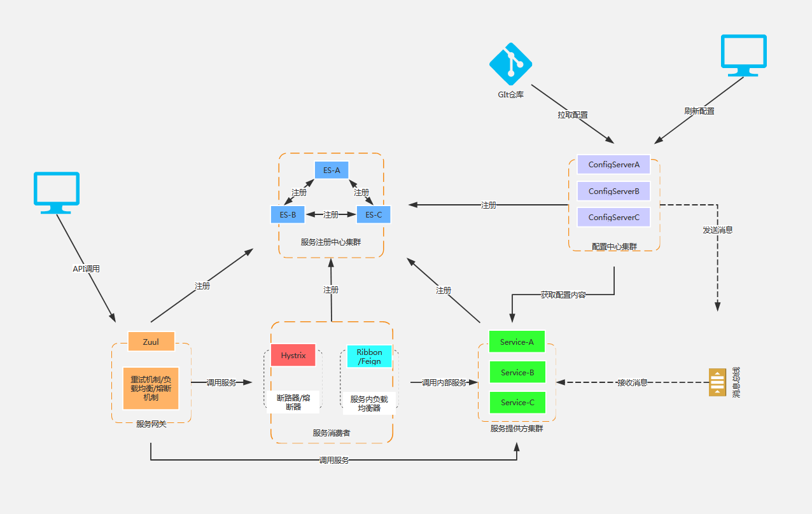

# SPRING CLOUD微服务

> Spring Cloud是一个基于Spring Boot实现的云原生应用开发工具，它为基于JVM的云原生应用开发中涉及的配置管理、服务发现、熔断器、智能路由、微代理、控制总线、分布式会话和集群状态管理等操作提供了一种简单的开发方式

## Spring Cloud核心子项目

- Spring Cloud Netflix：核心组件，可以对多个Netflix OSS开源套件进行整合，包括以下几个组件：    
    - Eureka：服务治理组件，包含服务注册与发现 
    - Hystrix：容错管理组件，实现了熔断器   
    - Ribbon：客户端负载均衡的服务调用组件   
    - Feign：基于Ribbon和Hystrix的声明式服务调用组件    
    - Zuul：网关组件，提供智能路由、访问过滤等功能    
    - Archaius：外部化配置组件    

- Spring Cloud Config：配置管理工具，实现应用配置的外部化存储，支持客户端配置信息刷新、加密/解密配置内容等。 
- Spring Cloud Bus：事件、消息总线，用于传播集群中的状态变化或事件，以及触发后续的处理  
- Spring Cloud Security：基于spring security的安全工具包，为我们的应用程序添加安全控制    
- Spring Cloud Consul : 封装了Consul操作，Consul是一个服务发现与配置工具（与Eureka作用类似），与Docker容器可以无缝集成   

